# Rinha de Backend 2025 - Payment Processor

Descrição do desafio proposto em: https://github.com/zanfranceschi/rinha-de-backend-2025/blob/75ae59c6b148f0dce0180ba20816314d0d25ad27/INSTRUCOES.md

Sistema intermediário que roteia pagamentos entre dois processadores (Default 5% taxa, Fallback 15% taxa) com estratégia de otimização inteligente.

## Arquitetura

- **Clean Architecture** Node/TypeScript
- **Load Balancer**: nginx com 2 instâncias da aplicação
- **Database**: PostgreSQL com Prisma ORM
- **Cache**: Redis para health checks
- **Filas**: BullMQ para processamento assíncrono
- **Workers**: Processamento em background com retry
- **Performance**: p99 < 10ms

## Execução

### 1. Iniciar Aplicação

```bash
cd solution
docker compose up -d
```

### 2. Verificar Status

```bash
curl http://localhost:9999/health
```

## Endpoints

### POST /payments

```bash
curl -X POST http://localhost:9999/payments \
  -H "Content-Type: application/json" \
  -d '{
    "correlationId": "123e4567-e89b-12d3-a456-426614174000",
    "amount": 100.50
  }'
```

### GET /payments-summary

```bash
curl "http://localhost:9999/payments-summary?from=2024-01-01T00:00:00.000Z&to=2024-12-31T23:59:59.999Z"
```

## Estratégia de Processamento

1. **Processamento Assíncrono**: Pagamentos são enfileirados e processados em background
2. **Preferência Default**: Workers tentam processador Default primeiro (5% taxa)
3. **Rate Limiting**: Health check limitado a 1 req/5s por processador
4. **Circuit Breaker**: Se Default falha, usa Fallback (15% taxa)
5. **Retry**: Jobs com falha são reprocessados até 3x com backoff exponencial
6. **Cache**: Status de saúde cached no Redis para performance

## Recursos

### CPU (1.5 unidades total)

- **nginx**: 0.1 CPU
- **app1**: 0.5 CPU
- **app2**: 0.5 CPU
- **worker1**: 0.3 CPU
- **worker2**: 0.3 CPU
- **postgres**: 0.3 CPU
- **redis**: 0.1 CPU

### Memória (350MB total)

- **nginx**: 32MB
- **app1**: 128MB
- **app2**: 128MB
- **worker1**: 96MB
- **worker2**: 96MB
- **postgres**: 48MB
- **redis**: 16MB

**Porta**: 9999

## Fluxo de Processamento

```mermaid
flowchart TD
    Client[Client] --> Nginx[Nginx Load Balancer]
    Nginx --> App1[App Instance 1]
    Nginx --> App2[App Instance 2]

    App1 --> HealthCheck{Check Default Health}
    App2 --> HealthCheck

    HealthCheck -->|Cache Hit| CacheDecision{Cache Status}
    HealthCheck -->|Cache Miss| DefaultProcessor[🟢 Default Processor<br/>5% fee]

    CacheDecision -->|Healthy| DefaultProcessor
    CacheDecision -->|Unhealthy| FallbackProcessor[🔴 Fallback Processor<br/>15% fee]

    DefaultProcessor -->|✅ Success| QueueJob1[Queue Payment Job]
    DefaultProcessor -->|❌ Fail| FallbackProcessor

    FallbackProcessor -->|✅ Success| QueueJob2[Queue Payment Job]
    FallbackProcessor -->|❌ Fail| Error[Return Error]

    QueueJob1 --> RedisQueue[Redis Queue]
    QueueJob2 --> RedisQueue

    RedisQueue --> Worker1[Worker 1]
    RedisQueue --> Worker2[Worker 2]

    Worker1 --> PostgreSQL[🗄️ PostgreSQL Database]
    Worker2 --> PostgreSQL

    subgraph "Health Cache Strategy"
        HealthCheck -.->|Rate Limit 5s| RedisCache[Redis Cache]
        RedisCache -.-> HealthCheck
    end
```


